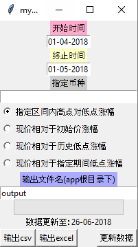

# myCryptoTool

[](https://opensource.org/licenses/MIT)

## 基本介绍

`myCryptoTool`是一个简单的基于Python和Tkinter的加密货币价格分析工具。
通过爬取[coinmarketcap.com](https://coinmarketcap.com/)上的加密货币价格信息来实现各种不同标准的排序功能。



起始时间和终止时间用来指定需要的区间，格式为`dd-mm-yyyy`。

指定币种输入框内输入币种的代号来指定币种，多个币种之间用半角空格分离。

输入例：`BTC ETH ADA XRP`

如果该输入框为空，则添加所有币种进行排序。

目前支持的功能为按照以下标准对指定的加密货币进行排序并输出CSV或者Excel文件：

* 指定区间内高点对低点涨幅
* 现价相对于初始价涨幅
* 现价相对于历史低点涨幅
* 现价相对于指定期间低点涨幅

第一次打开此app时建议首先点击右下角【更新数据】按钮更新最新的价格数据。视网络情况，更新耗时20到40分钟左右。

预计以后将会追加更多的功能。另外欢迎通过pull request的方式来为此app追加功能。

## 安装及运行

本app支持的Python版本为3.4及以上。

```bash
# 下载并安装依存库
git clone https://github.com/superkerokero/myCryptoTool.git
cd myCryptoTool
pip install -r requirements.txt

# 运行app
cd src
python app.py
```


## 使用pyinstaller打包为独立可执行文件

在确定已经安装pyinstaller的前提下，移动至src目录下执行如下命令：
```bash
pyinstaller --onefile --additional-hooks-dir=. app.py
```
然后将src下的data文件夹拷贝至dist/app文件夹下，即可得到可独立执行的exe文件。